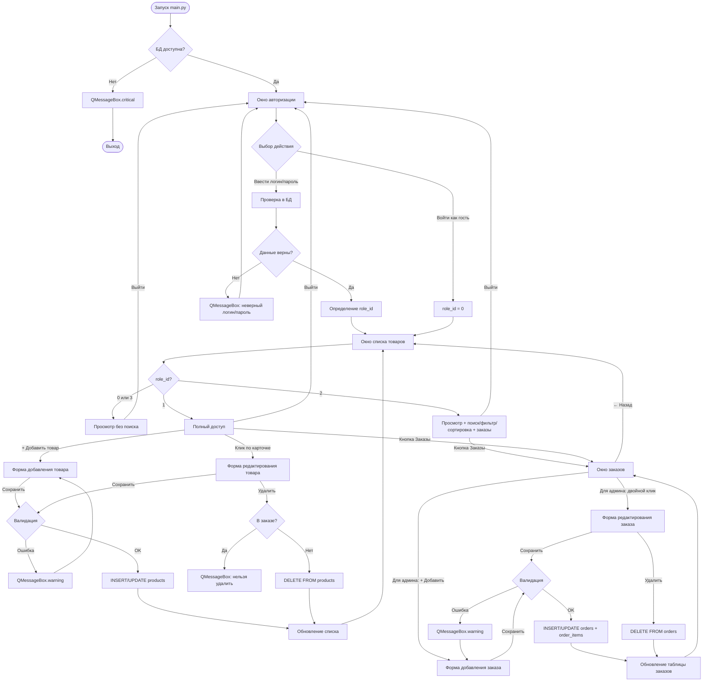

# Алгоритм работы приложения «ООО «Обувь»

## 1. Запуск приложения

1. `main.py` запускает QApplication.
2. Создаётся экземпляр класса `Application`.
3. Проверяется подключение к базе данных MySQL (`database.py → create_connection()`).
4. Если БД недоступна — показывается QMessageBox.critical с инструкцией.
5. Открывается окно авторизации (`LoginWindow`).

## 2. Подключение к базе данных

- Модуль `database.py` содержит функции `create_connection()` и `close_connection()`.
- Параметры подключения: host=127.0.0.1, port=3306, user=root, password=root, database=shoe_shop.
- Во всех окнах подключение создаётся через `create_connection()` и закрывается после выполнения запроса.

## 3. Авторизация

1. Пользователь вводит логин и пароль (или нажимает «Войти как гость»).
2. При нажатии «Войти» выполняется SQL-запрос с параметрами:
   ```sql
   SELECT u.id, u.full_name, u.role_id, r.name AS role_name
   FROM users u
   JOIN roles r ON u.role_id = r.id
   WHERE u.login = %s AND u.password = %s
   ```
3. Если пользователь найден — открывается окно списка товаров.
4. Если не найден — QMessageBox.warning «Неверный логин или пароль».
5. При входе как гость: `user_data = {id: None, full_name: "Гость", role_id: 0, role_name: "Гость"}`.

## 4. Определение роли

После авторизации `user_data["role_id"]` определяет доступные функции:

| role_id | Роль | Возможности |
|---------|------|-------------|
| 0 | Гость | Просмотр товаров (без поиска/сортировки/фильтрации) |
| 3 | Авторизованный клиент | Просмотр товаров (без поиска/сортировки/фильтрации) |
| 2 | Менеджер | Просмотр товаров + поиск/сортировка/фильтрация + заказы |
| 1 | Администратор | Полный CRUD товаров и заказов + поиск/сортировка/фильтрация |

## 5. Загрузка списка товаров

1. Вызывается `get_all_products()` или `get_filtered_products()` из `db_helpers.py`.
2. SQL-запрос объединяет таблицы `products`, `categories`, `manufacturers`, `suppliers`.
3. Товары отображаются в QScrollArea как карточки ProductCard.
4. Каждая карточка содержит:
   - Фото товара (QLabel с QPixmap)
   - Категорию, наименование, артикул, описание
   - Производителя и поставщика
   - Количество на складе
   - Цену со скидкой (перечёркнутая оригинальная цена + итоговая)
5. Визуальные состояния карточки:
   - Скидка > 15% → фон #2E8B57
   - Нет на складе → голубой фон (#ADD8E6)
   - Скидка > 0 → оригинальная цена красная, перечёркнутая

## 6. Поиск, фильтрация, сортировка

Доступно для менеджера и администратора.

1. Поле поиска (QLineEdit) — поиск по артикулу, наименованию, категории, описанию, производителю, поставщику, единице измерения.
2. Фильтр по поставщику (QComboBox) — «Все поставщики» сбрасывает фильтр.
3. Сортировка (QComboBox) — по количеству на складе: без сортировки / по возрастанию / по убыванию.
4. Все изменения применяются в реальном времени (QTimer с задержкой 300 мс).
5. Поиск, фильтр и сортировка работают совместно.

SQL-запрос с фильтрацией:
```sql
SELECT ... FROM products p
JOIN categories c ON p.category_id = c.id
JOIN manufacturers m ON p.manufacturer_id = m.id
JOIN suppliers s ON p.supplier_id = s.id
WHERE (p.article LIKE %s OR p.name LIKE %s OR ...)
  AND (p.supplier_id = %s)  -- если выбран поставщик
ORDER BY p.stock_quantity ASC/DESC  -- если выбрана сортировка
```

## 7. CRUD товаров

Доступно только администратору.

### Добавление
1. Кнопка «+ Добавить товар» → `ProductFormWindow(product_id=None)`.
2. Заполнение полей: артикул, наименование, категория, описание, производитель, поставщик, цена, единица измерения, количество, скидка, фото.
3. Валидация: обязательные поля, цена ≥ 0, количество ≥ 0, скидка 0–100.
4. Фото масштабируется до 300×200 px (Pillow), сохраняется в `resources/products/`.
5. INSERT в таблицу `products`.

### Редактирование
1. Клик по карточке товара → `ProductFormWindow(product_id=id)`.
2. Все поля подгружаются из БД.
3. При замене фото старый файл удаляется (если не picture.png).
4. UPDATE таблицы `products`.

### Удаление
1. Кнопка «Удалить товар» на форме редактирования.
2. Проверка: есть ли товар в `order_items`.
3. Если есть — QMessageBox.warning «Товар присутствует в заказе».
4. Если нет — DELETE FROM products.

### Обновление списка
После добавления/редактирования/удаления вызывается `_refresh_products()`.

## 8. Работа с заказами

Доступно менеджеру (просмотр) и администратору (полный CRUD).

### Просмотр заказов
1. Кнопка «Заказы» → `OrdersWindow`.
2. Таблица QTableWidget с колонками: номер, состав, статус, пункт выдачи, дата заказа, дата выдачи, ФИО клиента, код получения.
3. Для менеджера — только чтение.
4. Для администратора — двойной клик открывает редактирование.

### Добавление заказа
1. Кнопка «+ Добавить заказ» → `OrderFormWindow(order_id=None)`.
2. Выбор статуса, пункта выдачи, клиента, дат, кода получения.
3. Добавление товаров: выбор из выпадающего списка, указание количества.
4. INSERT в `orders` и `order_items`.

### Редактирование заказа
1. Двойной клик по строке заказа → `OrderFormWindow(order_id=id)`.
2. Подгрузка данных, обновление состава заказа.
3. UPDATE + DELETE/INSERT в `order_items`.

### Удаление заказа
1. Кнопка «Удалить заказ» на форме редактирования.
2. DELETE FROM orders (CASCADE удаляет order_items).

## 9. Выход из системы

1. Кнопка «Выйти» → все окна закрываются.
2. Открывается окно авторизации.
3. Пользователь может войти заново или продолжить как гость.

---

## Блок-схема алгоритма (Mermaid)


